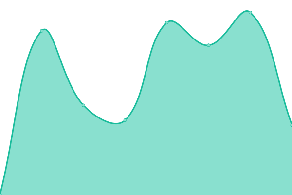
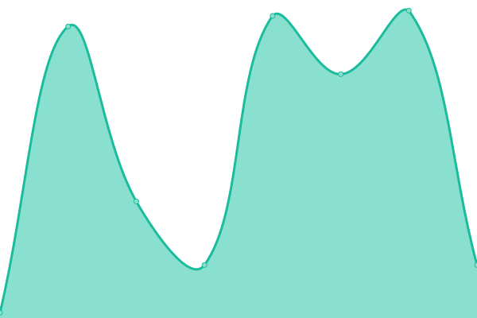
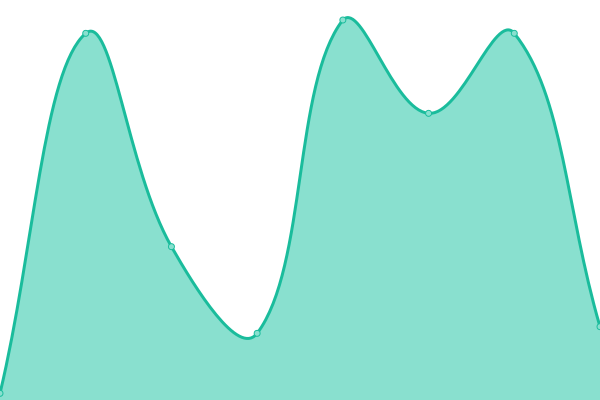

# [📈 Live Status](https://diveliastudio.github.io/cobi-upptime): <!--live status--> **🟩 All systems operational**

This repository contains the open-source uptime monitor and status page for [diveliastudio](https://diveliastudio.github.io/cobi-upptime), powered by [Upptime](https://github.com/upptime/upptime).

With [Upptime](https://upptime.js.org), you can get your own unlimited and free uptime monitor and status page, powered entirely by a GitHub repository. We use [Issues](https://github.com/diveliastudio/cobi-upptime/issues) as incident reports, [Actions](https://github.com/diveliastudio/cobi-upptime/actions) as uptime monitors, and [Pages](https://diveliastudio.github.io/cobi-upptime) for the status page.

<!--start: status pages-->
<!-- This summary is generated by Upptime (https://github.com/upptime/upptime) -->
<!-- Do not edit this manually, your changes will be overwritten -->
<!-- prettier-ignore -->
| URL | Status | History | Response Time | Uptime |
| --- | ------ | ------- | ------------- | ------ |
|  Cobi API | 🟩 Up | [cobi-api.yml](https://github.com/diveliastudio/cobi-upptime/commits/HEAD/history/cobi-api.yml) | 

 1017ms
     
 | 

<a href="https://diveliastudio.github.io/cobi-upptime/history/cobi-api">98.28%</a>
    

|  MQTT Port | 🟩 Up | [mqtt-port.yml](https://github.com/diveliastudio/cobi-upptime/commits/HEAD/history/mqtt-port.yml) | 

 42ms
     
 | 

<a href="https://diveliastudio.github.io/cobi-upptime/history/mqtt-port">100.00%</a>
    

|  WS Port | 🟩 Up | [ws-port.yml](https://github.com/diveliastudio/cobi-upptime/commits/HEAD/history/ws-port.yml) | 

 42ms
     
 | 

<a href="https://diveliastudio.github.io/cobi-upptime/history/ws-port">100.00%</a>
    

<!--end: status pages-->

[**Visit our status website →**](https://diveliastudio.github.io/cobi-upptime)

## 📄 License

- Powered by: [Upptime](https://github.com/upptime/upptime)
- Code: [MIT](./LICENSE) © [diveliastudio](https://diveliastudio.github.io/cobi-upptime)
- Data in the `./history` directory: [Open Database License](https://opendatacommons.org/licenses/odbl/1-0/)
